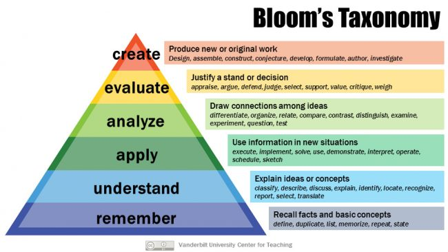

# Purpose
Research the education frameworks that exist to create courses and measure their impact.

# Frameworks
* [Bloom's Taxonomy](#blooms-taxonomy)
* [CIPP Evaluation Model](#cipp-evaluation-model)
* [The Learning Pyramid](#the-learning-pyramid)
* [The New World Kirkpatrick Model](#the-new-world-kirkpatrick-model)

## Bloom's Taxonomy
[Bloom's Taxonomy](https://cft.vanderbilt.edu/guides-sub-pages/blooms-taxonomy/) is a framework for categorizing educational goals.  

The categories are:

* **Remember:** recall facts and basic concepts.
* **Understand:** explain ideas and concepts.
* **Apply:** use information in new situations.
* **Analyze:** draw connections amoung ideas.
* **Evaluate:** justify a decision.
* **Create:** produce new or original work.

These categories then contain the following subcategories:

* **Remember**
  * Recognizing
  * Recalling
* **Understand**
  * Interpreting
  * Exemplifying
  * Classifying
  * Summarizing
  * Inferring
  * Comparing
  * Explaining
* **Apply**
  * Executing
  * Implementing
* **Analyze**
  * Differentiating
  * Organizing
  * Attributing
* **Evaluate**
  * Checking
  * Critiquing
* **Create**
  * Generating
  * Planning
  * Producing

A separate taxonomy for knowledge was also created:

* **Factual Knowledge**
  * Knowledge of terminology
  * Knowledge of specific details and elements
* **Conceptual Knowledge**
  * Knowledge of classifications and categories
  * Knowledge of principles and generalizations
  * Knowledge of theories, models, and structures
* **Procedural Knowledge**
  * Knowledge of subject-specific skills and algorithms
  * Knowledge of subject-specific techniques and methods
  * Knowledge of criteria for determining when to use appropriate procedures
* **Metacognitive Knowledge**
  * Strategic Knowledge
  * Knowledge about cognitive tasks, including appropriate contextual and conditional knowledge
  * Self-knowledge

## CIPP Evaluation Model
[CIPP](https://en.wikipedia.org/wiki/CIPP_evaluation_model) is a program evaluation model based on Context, Input, Process and Product.  Its goal is to evaluate a program before and after it has run by answering the following questions:

* **Context:** What needs to be done? 
* **Input:** How should it be done?
* **Process:** Is it being done?
* **Product:** Is it succeeding?

[A series of checklists](https://wmich.edu/sites/default/files/attachments/u350/2014/cippchecklist_mar07.pdf) exist to answer each of these questions.

## The Learning Pyramid
[The Learning Pyramid Model](https://www.educationcorner.com/the-learning-pyramid.html) describes the different types of learning and how effective they are in terms of students learning and retaining concepts:

### Lecture: 
* Least effective, passive form of learning where you sit and listen to information.  
* Relies on auditory learning.  
* Most effective when students are prepared and actively participate.

### Reading:
* More effective than lecture, but still generally ineffective.
* Supports visual learners.

### Audio-visual
* Results in 20% retention rate.
* Supports audio-visual learners.
* As more interactive audio-visual media is developed (VR), the effectiveness of this teaching style improves.

### Demonstration
* Students observe a task being performed (apprenticeship model).
* The first firm of Active learning in the pyramid.
* Leads to less ambiguity and greater understanding than passive learning.

### Discussion
* Cooperaetive learning - students and instructors interacting and studying together.
* Increases thinking, participation and engagement.

### Practice (by) doing
* A form of discovery learning.
* One of the most effective forms of learning and study.
* Students take what they learn and put it into practice (aprenticeship model).
* Promotes deeper understanding and moves information from short-term to long-term memory.
* Leads to very in-depth understanding.

### Teach others
* Key to subject mastery is being able to accurately and correctly teach others.
* Students are able to retain 90% of what they teach others.
* Can take the form of peer tutoring or study group.

## The New World Kirkpatrick Model
[An update to the Kirkpatrick Model](https://www.kirkpatrickpartners.com/Our-Philosophy/The-New-World-Kirkpatrick-Model) that clarifies the four levels of training evaluation.  The four levels are:

1. **Reaction:** The degree to which participants find the training favorable, engaging and relevant to their jobs
1. **Learning:** The degree to which participants acquire the intended knowledge, skills, attitude, confidence and commitment based on their participation in the training
1. **Behaviour:** The degree to which participants apply what they learned during training when they are back on the job
1. **Results:** The degree to which targeted outcomes occur as a result of the training and the support and accountability package

### Level 1: Reaction
* Participant satisfaction in the training

New World Additions:

* Participant engagement
* Relevance of the training to the participant

### Level 2: Learning

* Knowledge:  “I know it.”
* Skill:      “I can do it right now.”
* Attitude:   “I believe this will be worthwhile to do on the job.”

New World Additions:

* Confidence:  “I think I can do it on the job.”
* Commitment:  “I intend to do it on the job.”

### Level 3: Behavior

New World Addition:

* Required Drivers
* Processes and systems that reinforce, encourage and reward performance of critical job behaviours

### Level 4: Results

New World Addition:

* Leading Indicators
* Short-term observations and measurements suggesting critical behaviors will create a positive impact 

